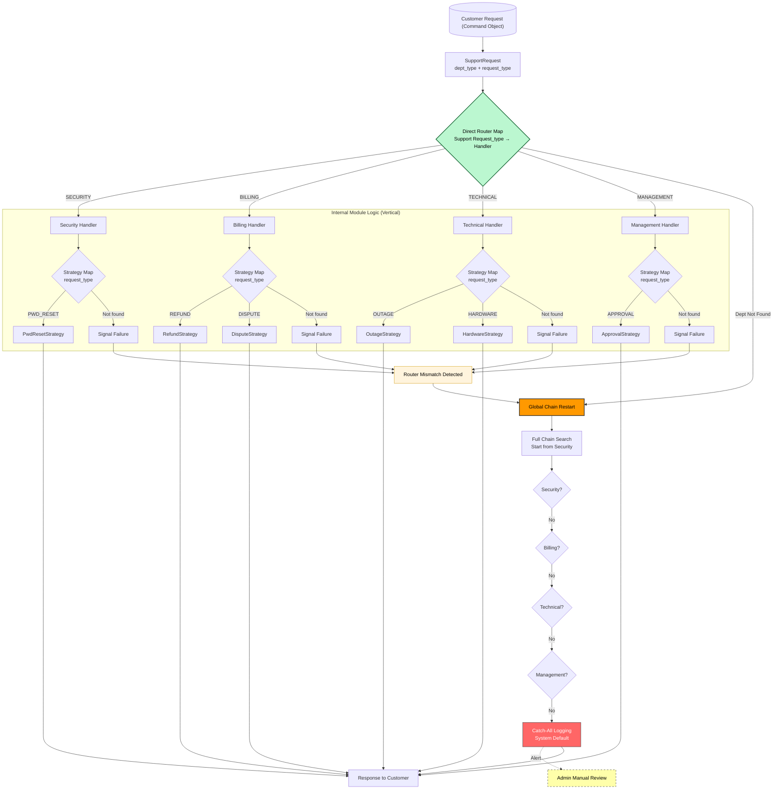

# Support Routing System - Hybrid Router-Chain Architecture

---

## Authors

This project was developed by the following students at **Makerere University**:

## Authors

This project was developed by the following students at **Makerere University**:

| Name                     | Student Number | Registration Number |
| ------------------------ | -------------- | ------------------- |
| Aryampa Joshua           | 2300706517     | 23/U/06517/PS       |
| Namata Sumayya           | 2300722615     | 23/U/22615          |
| Mushabe Moses            | 2300712131     | 23/U/12131/EVE      |
| Nakaye Hildah            | 2300713598     | 23/U/13598/PS       |
| Mukyala Dorcus Nandel    | 2300711911     | 23/U/11911/EVE      |
| Sessanga Jim Edward      | 2300717752     | 23/U/17752/EVE      |
| Arigye Dorcus            | 2300706378     | 23/U/06378/EVE      |
| Mbasani Pauline Peace    | 2300700765     | 23/U/0765           |
| Kiyimba Fahad            | 2300700628     | 23/U/0628           |
| Tumukunde Kato Andrew    | 2300718082     | 23/U/18082/PS       |


**Affiliation:** Department of Networks, College of Computing and Information Sciences, Makerere University, Uganda.

---

## Support Routing System - Hybrid Router-Chain Architecture
A high‑performance, modular support routing system that combines **O(1) direct routing** with a **Chain of Responsibility fallback** to ensure 100% resilience. No request ever gets lost—even when direct routes fail, the system performs a full chain search to find the right handler.

## Overview

The system handles support requests (e.g., password reset, outage reporting, billing inquiries) by:
- **Direct routing** – Jump immediately to a dedicated handler using a lookup map (`O(1)` latency for ~99% of traffic).
- **Internal strategy maps** – Each handler resolves sub‑tasks via a pluggable `Strategy` pattern, avoiding nested `if/else` logic.
- **Chain of Responsibility fallback** – If a direct route leads to a “dead end” (no internal strategy), the request travels through the chain of all handlers.
- **Global restart** – When a direct horizontal jump fails completely, the platform catches the failure and restarts a full search from the head of the chain.

This design guarantees **zero tight coupling** between modules (e.g., `Billing` never knows about `Security`) and makes adding new modules trivial—only a one‑line registry update.

## System Architecture Diagram

---

## Architecture Highlights

| Feature               | Mechanism                                                  | Benefit                                                       |
| --------------------- | ---------------------------------------------------------- | ------------------------------------------------------------- |
| **Low latency**       | Horizontal map routing bypasses sequential hops           | `O(1)` for standard requests                                  |
| **Resilience**        | Chain of Responsibility + global restart                  | No request lost, even on misrouting or missing strategies    |
| **Decoupling**        | `BaseHandler` contract + `Registry` mediator              | Modules are 100% independent; changes ripple only to registry |
| **Open‑Closed**       | Strategy pattern inside each handler                      | Add new sub‑tasks without touching existing handler logic     |
| **Encapsulation**     | `SupportRequest` command object                            | Standardised “Internal API” between all layers                |

---

## Design Patterns Used

| Pattern                  | Implementation                           | Role                                                                                     |
| ------------------------ | ---------------------------------------- | ---------------------------------------------------------------------------------------- |
| **Command**              | `SupportRequest` class                   | Encapsulates all ticket data (ID, category, feature, user, metadata). Acts as internal API. |
| **Strategy**             | Internal `feature_map` per handler       | Eliminates nested `if/else`; direct `O(1)` lookup for local features.                   |
| **Chain of Responsibility** | Linked handlers (`_next`)             | Safety net for requests that cannot be processed locally.                                |
| **Registry / Mediator**  | `registry.py`                            | Central wiring of handlers and routing map – modules never reference each other directly. |

---

## How to Run

### Requirements
- Python 3.8 or higher (no external dependencies for the core logic)

### Execution
> **Crucial**: You must run the application from the **project root directory** (where the `src/` folder lives).  
> Python resolves the package structure correctly only when launched from the root.

```bash
# Navigate to the project root (e.g., /path/to/support-rotuing-system)
python3 main.py
```

---

## Contributing

1. Fork the repository.
2. Create a feature branch.
3. Add your new module (e.g., `legal_handler.py`).
4. Register it in `registry.py` (add to handler list and map).
5. you may chose to add departments or strategies if any in that handler
6. Write tests.
7. Submit a pull request.

## License

This project is provided as a reference architecture. You may adapt and use it freely in your own systems.
